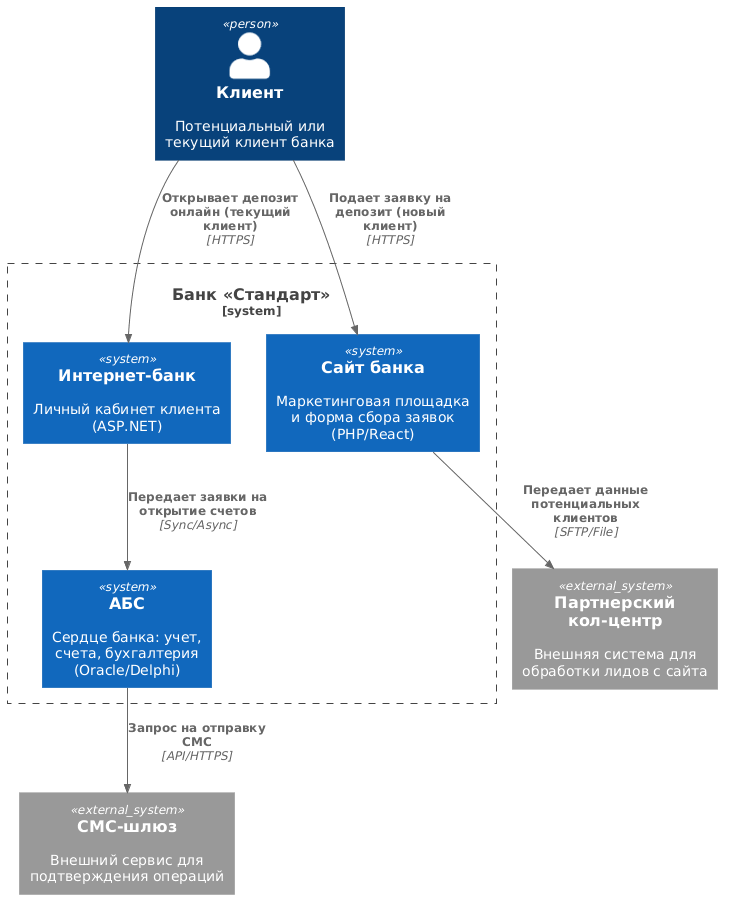
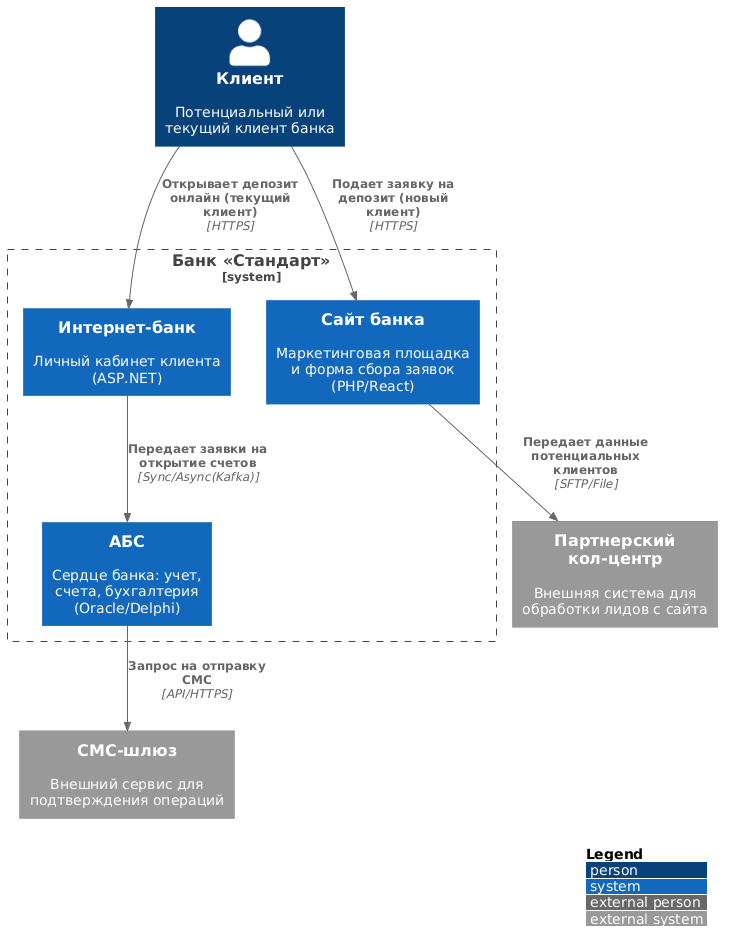

# ADR: Внедрение процесса онлайн-открытия депозитов (MVP)

**Название задачи:** Цифровая трансформация процесса открытия депозитов и накопительных счетов.
**Автор:** @fidel-1
**Дата:** 04.04.2026

---

### **Функциональные требования**

Процесс охватывает как новых клиентов (через сайт), так и действующих (через интернет-банк).

| **№** | **Действующие лица** | **Use Case** | **Описание** |
| :---: | :--- | :--- | :--- |
| 1 | Клиент, Сайт | Подача заявки (Lead) | Новый клиент оставляет ФИО и телефон. Данные передаются в CRM для прозвона. |
| 2 | Клиент, Интернет-банк | Открытие депозита (MVP) | Действующий клиент выбирает параметры вклада и подтверждает операцию СМС-кодом. |
| 3 | Менеджер бэк-офиса, АБС | Обработка заявки | Сотрудник проверяет условия и подтверждает открытие в интерфейсе АБС. |
| 4 | АБС, СМС-шлюз | Нотификация | Система отправляет СМС об успешном открытии счета или согласовании ставки. |

---

### **Нефункциональные требования**

| **№** | **Категория** | **Требование** |
| :---: | :--- | :--- |
| 1 | **Availability** | Доступность 99,9% (24/7). Поддержка переключения на резервный ЦОД. |
| 2 | **Performance** | Время отклика по операциям — миллисекунды (решение проблемы медленных справочников). |
| 3 | **Scalability** | Возможность горизонтального масштабирования новых компонентов под маркетинговые акции. |
| 4 | **Security** | Шифрование трафика (TLS) и исключение прямого доступа Интернет-банка к БД АБС. |
| 5 | **Maintainability** | Использование существующего стека (Java/Oracle/MS SQL) и переход к микросервисам. |

---

### **Решение**

Для реализации MVP выбрана стратегия внедрения промежуточного слоя — **Deposit Service**.

1. **Разделение ответственности**: Новый микросервис (Java Spring Boot) берет на себя логику работы с заявками и хранение кэша ставок. Это позволяет не дорабатывать закрытое ядро Интернет-банка (ASP.NET).
2. **Оптимизация производительности**: Актуальные ставки кэшируются в локальной БД (PostgreSQL), что гарантирует быстрый отклик интерфейсов (миллисекунды).
3. **Асинхронность**: Интеграция с АБС выполняется через брокер сообщений (Kafka) или специализированный API-адаптер. Это снимает нагрузку с основной базы данных Oracle.

#### **Диаграмма контекста (C4 Context)**

#### **Диаграмма контейнеров (C4 Containers)**

---

### **Альтернативы**

* **Доработка монолита Интернет-банка**: Отклонено из-за высокой стоимости и зависимости от циклов релиза внешнего подрядчика.
* **Прямые вызовы API АБС**: Отклонено из-за перегруженности БД Oracle и риска нарушения стабильности работы банка.

---

### **Недостатки, ограничения, риски**

* **Риск задержки данных**: Из-за кэширования ставок в микросервисе возможна ситуация, когда клиент видит ставку, которая изменилась в АБС несколько секунд назад.
* **Инфраструктурная сложность**: Необходимость развертывания и поддержки Kafka и новых БД требует ресурсов DevOps.
* **Legacy-зависимость**: На этапе MVP бэк-офис всё еще участвует в процессе подтверждения заявок вручную в АБС.