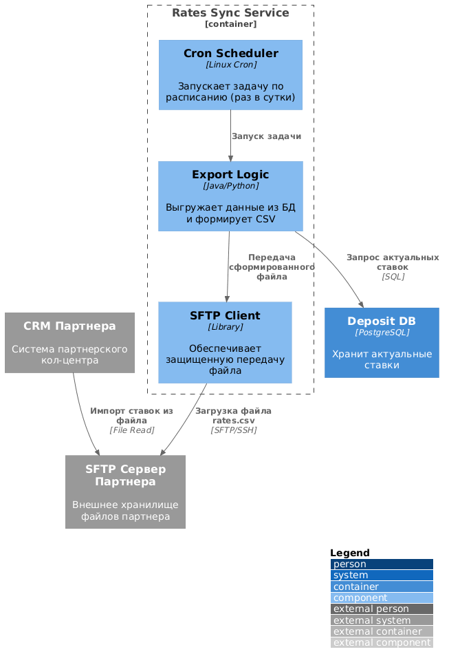

# ADR: Интеграция систем кол-центра и передача актуальных ставок

**Название задачи:** Обеспечение доступности данных о ставках для внутреннего и партнерского кол-центров.
**Автор:** @fidel-1
**Дата:** 04.04.2026

---

### **Функциональные требования**

Основная цель — информирование операторов о текущих условиях по депозитам для консультации клиентов.

|**№**|**Действующие лица**|**Use Case**|**Описание**|
| :-: | :- | :- | :- |
| 1 | Оператор банка | Просмотр ставок в CRM | Оператор видит актуальные ставки в веб-интерфейсе своей системы при звонке клиента. |
| 2 | Оператор партнера | Получение файла со ставками | Внешняя система партнера импортирует файл со ставками для отображения в своих скриптах. |
| 3 | Система (Cron) | Экспорт данных | Автоматическая выгрузка актуальных ставок из банковского контура во внешнюю среду. |

---

### **Нефункциональные требования**

|**№**|**Требование**|
| :-: | :- |
| 1 | **Безопасность**: Передача данных партнеру только через защищенный канал (SFTP). |
| 2 | **Актуальность**: Обновление данных в кол-центрах не реже одного раза в сутки (согласно циклу обновления Excel в бэк-офисе). |
| 3 | **Надежность**: Гарантированная доставка файла партнеру. Логирование процесса выгрузки. |
| 4 | **Минимальное вмешательство**: Использование существующих технологий (Java в КЦ, PL/SQL в АБС). |

---

### **Решение**

Для решения задачи предлагается внедрение **Сервиса синхронизации ставок (Rates Sync Service)**.

1. **Для внутреннего КЦ**: Поскольку система КЦ банка написана на Java Spring Boot, а в команде АБС есть Java-разработчики, мы реализуем API-метод в системе КЦ, который будет подтягивать данные из созданного нами в Task 3 `Deposit Service` (или напрямую из реплики БД АБС через адаптер).
2. **Для партнера (File-based integration)**: 
    * Создается ETL-процесс (Extract, Transform, Load), который собирает данные из справочника ставок.
    * Формируется файл (CSV/XML) в соответствии с согласованным форматом партнера.
    * Файл автоматически загружается на SFTP-сервер, к которому имеет доступ партнерский КЦ.

**Логика решения:** Это позволяет избежать сложной разработки API на стороне партнера и быстро закрыть потребность в данных, используя привычный им файловый обмен.

Для интеграции с партнером выбран файловый обмен через SFTP, так как это гарантирует безопасность данных и соответствует техническим ограничениям внешней системы.

Автоматизация процесса реализована через Cron-планировщик, что обеспечивает относительную актуальность данных без ручного вмешательства.

#### **Диаграмма контекста (C4 Context)**

#### **Диаграмма компонентов**

---
---

### **Список крупных задач по системам**

**1. Deposit Service / АБС:**
* Разработка витрины данных (View) или API с актуальными ставками, агрегирующей данные из Excel-загрузок бэк-офиса.

**2. Система кол-центра банка (CRM):**
* Доработка UI: добавление виджета "Актуальные ставки".
* Интеграция с Deposit Service для получения данных в реальном времени.

**3. Rates Sync Service (новый компонент/скрипт):**
* Разработка логики формирования выгрузки (генерация CSV).
* Настройка расписания (Cron job).
* Реализация транспорта файлов по протоколу SFTP.

**4. Инфраструктура:**
* Развертывание защищенного SFTP-сервера в DMZ-зоне банка.
* Настройка сетевых доступов для партнера.

---

### **Альтернативы**

* **Ручная рассылка Excel-файлов операторам**: Отклонено из-за высокого риска ошибок и низкой скорости обновления.
* **Предоставление партнеру доступа к API банка**: Отклонено, так как партнер технически не готов к реализации API-вызовов и это требует более строгих мер безопасности (WAF, API Gateway).

---

### **Недостатки, ограничения, риски**

* **Риск нарушения целостности**: Если файл не загрузится или загрузится частично, партнер будет консультировать по старым ставкам. Требуется мониторинг.
* **Формат файла**: Любое изменение структуры ставок в банке потребует синхронного изменения парсера на стороне партнера.
* **Задержка**: Файловый обмен — это всегда задержка по сравнению с API (Data Latency).